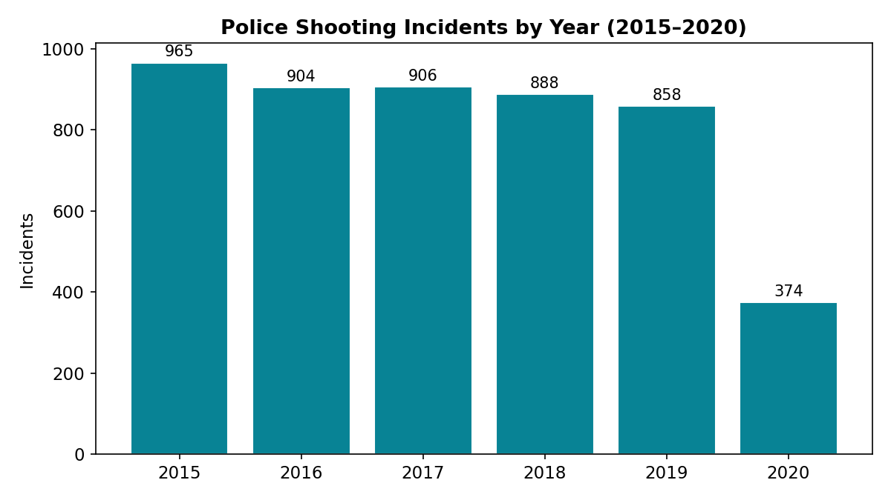
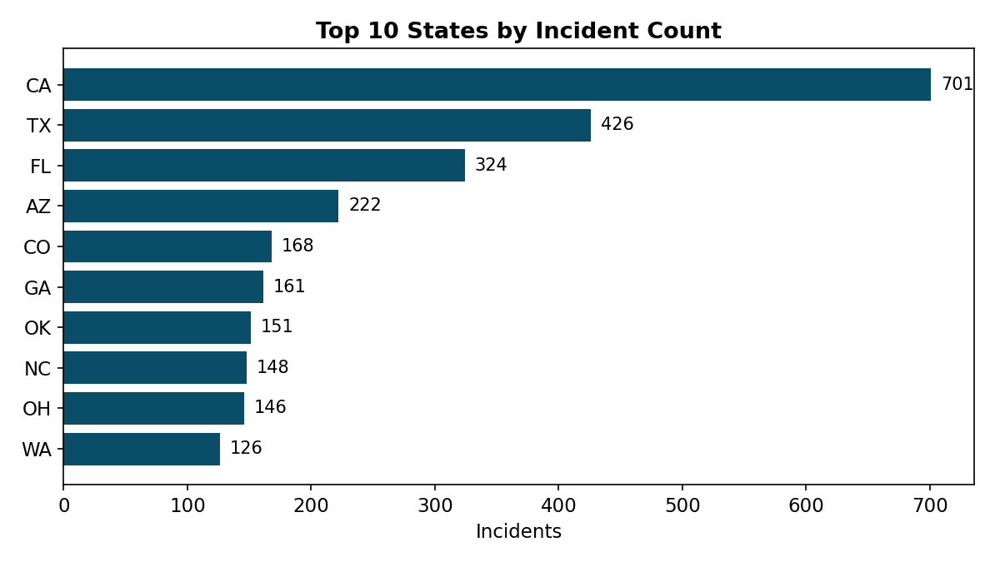
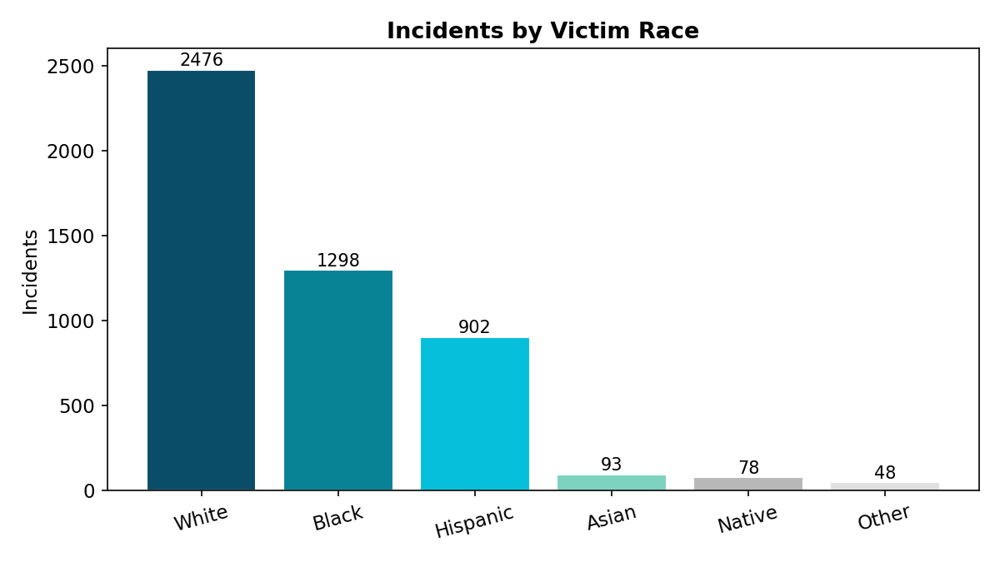
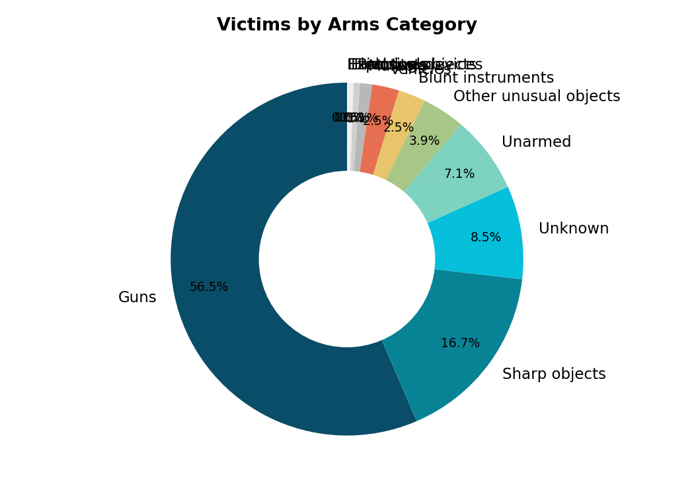
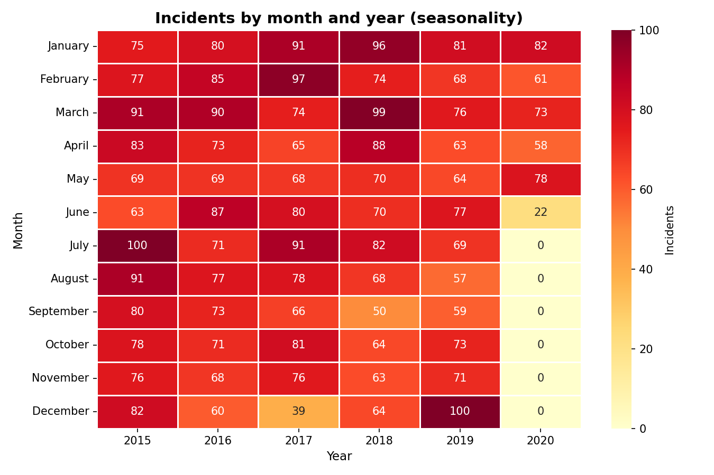
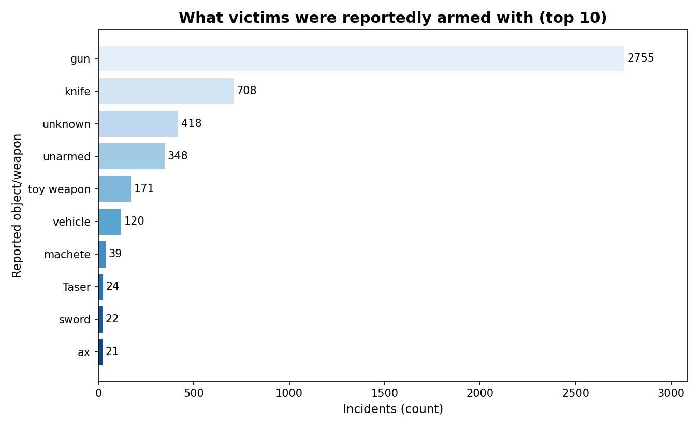
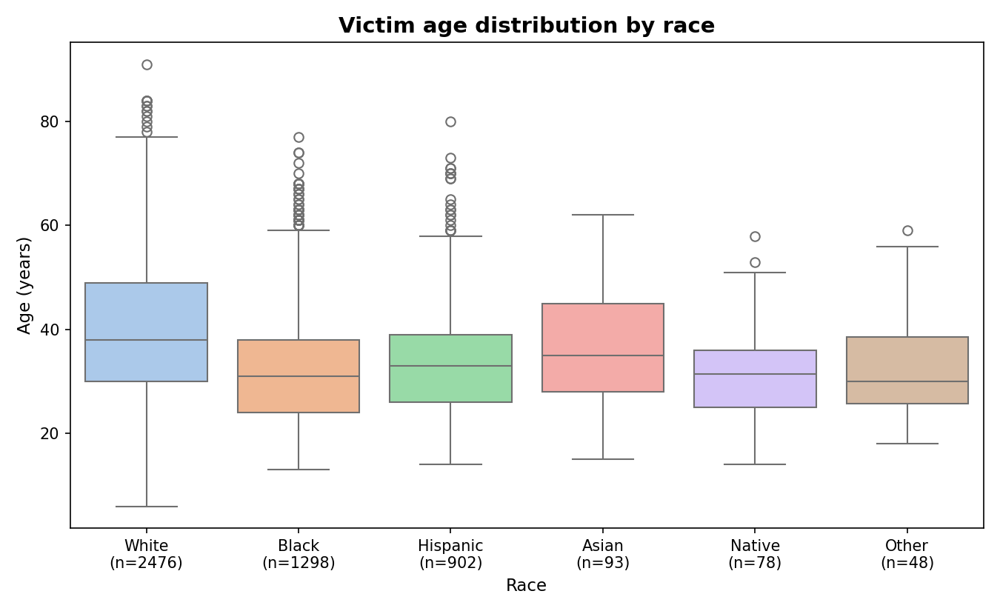
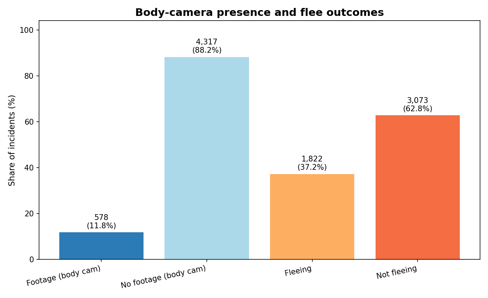

# Uncovering Trends in Police Shootings: A Data-Driven Dashboard

IS 525 final project (UIUC) — an interactive Tableau dashboard exploring
4,895 police-involved shooting incidents across the U.S. (2015–2020, 50 states
+ DC), built for a public-policy research audience.

Team: Hsin-Tzu Lin, Ke Xu, Zih-Yi Cao, Yi-Han Huang.

## The question

Public debate about police-involved shootings runs on anecdotes. We built a
descriptive "source of truth" dashboard so analysts, researchers, and the
public can see what happened, where, and to whom — across time, geography,
and demographics.

## What's inside

**`tableau/IS525_Final_Project.twbx`** — packaged Tableau workbook
(open with Tableau Desktop or Tableau Public):

| Dashboard | Contents |
|---|---|
| Overview | KPI cards, yearly shooting trend, armed/unarmed distribution |
| Geographic Analysis | Filled state map, city-level cluster map, top-10 states bar chart, state × year heatmap |
| Dashboard 2 / 4 | Demographic views: shootings by race over year, box plots & histograms of victim age, armed vs unarmed breakdowns |
| Temporal views | Multi-year monthly line chart, year × month count heatmap |

15 worksheets total. Race, armed-status, and date filters are applied
consistently across every view.

**`data/shootings.csv`** — 4,895 records: date, city/state, victim demographics
(age, gender, race), armed status, weapon category, threat level, flee status,
body-camera presence, signs of mental illness. (Source: U.S. Police Shootings
dataset, Kaggle.)

**`reports/final_report.pdf`** — full write-up: methodology, findings,
challenges, and client feedback.

## Key findings

- **No strong seasonal pattern** — month-to-month variation is irregular and
  differs year to year; the year × month heatmap shows pockets of activity
  driven by external factors, not calendar cycles.
- **Stable demographics over time** — victim composition by race is persistent
  across years; most victims fall in the 25–40 age range, with unarmed victims
  skewing slightly younger.
- **Geographic concentration** — incidents cluster in populous states
  (California, Texas, Florida) and metro areas (Los Angeles, Chicago,
  Oklahoma City), not evenly across the country.
- **Armed vs unarmed** — weapon types were consolidated into armed/unarmed
  groupings to make demographic comparisons legible.

## Build notes

- Decluttered the city cluster map (mark size, transparency, zoom) so dense
  urban areas stay readable.
- Tableau wouldn't average Boolean expressions, so armed-status flags were
  converted to 0/1 numerics to compute demographic percentages with `AVG()`.
- Client feedback (a public-policy research institute) drove simpler color
  schemes and the addition of the state × year heatmap.

## Dashboard Preview

An interactive version of this dashboard is live on the portfolio site: **https://zihyic.github.io/police-shootings-dashboard.html**

## More Results

